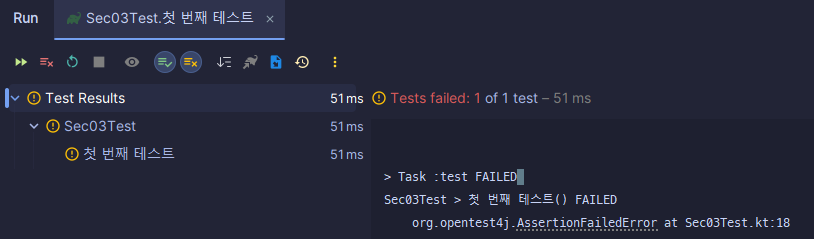
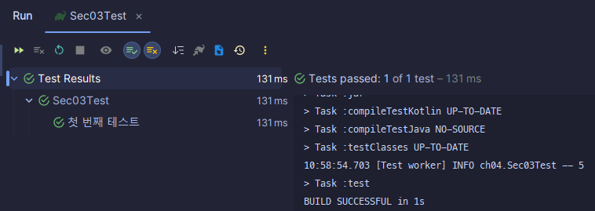

:toc:
:doctype: book
:icons: font
:icon-set: font-awesome
:source-highlighter: highlightjs
:toclevels: 4
:sectlinks:
:author: "mon0mon"
:hardbreaks:

= Chapter 4 테스트 구축하기

리팩터링은 분명 가치 있는 도구이지만, 제대로 효과를 보기위해서는 테스트 스위트(Test suite)가 뒷받침되어야 한다

꼭 리팩터링이 아니더라도, 좋은 테스트는 개발 효율성을 높여준다

== 4.1 자가 테스트 코드의 가치

실제 코드를 작성하는 시간의 비중은 크지 않음
* 현재 상황을 파악
* 설계 고민
* 디버깅

이 중에서 **디버깅**은 가장 흔한 케이스
버그를 수정하는 과정에서 또 다른 버그를 만들기도 하며, 이로 인해 많은 시간이 소모

테스트를 만들고 확인하는 과정 역시 소모적이기에, 자동화된 테스트가 필요

[quote]
____
테스트를 자주 수행 할 수록, 버그를 쉽게 찾을 수 있음
____

테스트는 프로그래밍을 시작하기 전에 작성하는 것이 가장 좋음
* 구현보다 인터페이스에 집중
* 코딩이 완료된 시점을 정확하게 판단할 수 있음

*테스트 주도 개발(TDD)*

== 4.2 테스트할 샘플 코드

.생산 계획
- 지역
-- 수요
-- 가격
- 생산자
-- 비용
-- 생산량
-- 수익 (비용 * 생산량)
- 현재 상황
-- 부족분 (수요 - 총 생산량)
-- 총수익

== 4.3 첫 번째 테스트

테스트 코드에서는 블록 단위로 테스트 스위트를 담는 구조로 되어있음
각 테스트에는 2가지 단계로 구분할 수 있음

.구분
- 픽스처(Fixture) 설정 = 테스트에 필요한 데이터와 객체
- 픽스처의 속성 검증 (AssertJ 사용)

Junit에서 실행 시 다음과 같은 결과가 나옴

[open]
.실행 결과
--
[source]
----
> Task :checkKotlinGradlePluginConfigurationErrors SKIPPED
> Task :compileKotlin UP-TO-DATE
> Task :compileJava NO-SOURCE
> Task :processResources NO-SOURCE
> Task :classes UP-TO-DATE
> Task :jar UP-TO-DATE
> Task :processTestResources NO-SOURCE
> Task :compileTestKotlin
> Task :compileTestJava NO-SOURCE
> Task :testClasses UP-TO-DATE
> Task :test
BUILD SUCCESSFUL in 1s
4 actionable tasks: 2 executed, 2 up-to-date
10:33:10: Execution finished ':test --tests "ch04.Sec03Test"'.
----
--

테스트 코드가 정상 동작하는 지를 확인하기 위해, 코드에 잘못된 로직을 의도적으로 주입

[open]
.실행 결과
--
[source]
----
Expected :5
Actual   :-20
<Click to see difference>

org.opentest4j.AssertionFailedError:
expected: 5
but was: -20

> Task :test FAILED
Sec03Test > 첫 번째 테스트() FAILED
org.opentest4j.AssertionFailedError at Sec03Test.kt:18
1 test completed, 1 failed
FAILURE: Build failed with an exception.
----
--

실패한 테스트 케이스는 기대 값과 실제 값의 차이 및, 실행한 코드의 stacktrace도 확인 가능
> 최대한 자주 테스트를 진행하자 (최소한 하루에 한 번은 전체 테스트를 수행해야함)

### RedBar

### GreenBar

== 4.4 테스트 추가하기

테스트는 단순히 public 메소드를 빠짐없이 하는 것이 아님
테스트의 목적은 `현재 또는 향후 발생하는 버그를 찾는 데` 있음

단순히 많은 테스트가 중요한 것이 아닌, 가장 필요한 테스트에 집중하는 것이 핵심
우려되는 부분에 대해서 집중적으로 테스트

[quote]
____
완벽하게 만드느라 테스트를 수행하지 못하는 것보다, 불완전한 테스트를 작성하는 것이 낫다
____

테스트 간 주의해야 할 사항은 공유 객체를 통한 테스트 간 영향을 줄이는 것이다

[source,kotlin]
----
class ProvinceTest {
    // 테스트 간 객체 공유로 인해, 다른 테스트에 영향을 줌
    private val province = json.decodeFromString(Province.serializer(), provinceJson)

    @Test
    fun `생산 부족분 테스트`() {
        // ...
    }

    @Test
    fun `총수익 계산 로직`() {
        // ...
    }
}
----

val 키워드는 province 변수에 대한 레퍼런스가 상수임을 나타냄 link:https://velog.io/@jhw970714/C-const-%EB%B3%80%EC%88%98const-%ED%8F%AC%EC%9D%B8%ED%84%B0[참고]

결과적으로 테스트 실행 순서에 따라 결과가 달라질 수 있으므로, 테스트는 물론 버그 잡기도 어려워 질 수 있음

그렇기에 매 테스트 실행 전, 새로운 객체로 초기화 하는 것이 중요
Junit에서는 @BeforeEach 어노테이션을 사용하여 테스트 실행 전 객체 초기화 가능

[source, kotlin]
----
class ProvinceTest {
    private lateinit var province: Province

    // 테스트 실행 전에 province 공유 객체 초기화
    @BeforeEach
    fun setUp() {
        province = json.decodeFromString(Province.serializer(), provinceJson)
    }

    @Test
    fun `생산 부족분 테스트`() {
        // ...
    }

    @Test
    fun `총수익 계산 로직`() {
        // ...
    }
}
----

== 4.5 픽스처 수정하기

beforeEach 블록에서 표준 픽스처를 `설정`
테스트를 `수행`
픽스처의 결과 값이 옳바른 지 `검증`

이와 같은 패턴을 다음과 같은 명칭을 가짐

- 설정-실행-검증(setup-exercise-verify)
- 조건-발생-결과(given-when-then)
- 준비-수행-단언(arrange-act-assert)

NOTE: 해체(teardown) 또는 청소(cleanup)이라는 네 번째 단계도 존재

일반적으로 테스트는 하나의 검증을 하는 것이 좋음
테스트가 실패할 경우, 다른 테스트 코드들은 실행해보지 못하고 실패하게 되기 때문
다만 한 테스트로 묶어도 문제가 되지 않을 정도로, 밀접한 경우에는 가능

== 4.6 경계 조건 검사하기

수요가 음수라는 가정이 고객 관점에서 말이 되지 않음
이러한 경우에 대한 테스트 코드를 작성하는 것이 중요

[quote]
____
문제가 생길 가능성이 있는 경계 조건을 생각해보고 그 부분을 집중적으로 테스트하자.
____

외부에서 들어온 입력 객체는 유효성을 반드시 확인해야함

- 어서션 추가하기^10.6절^를 적용해, 최대한 빨리 오류가 드러나도록 하기

테스트에도 수확 체감 법칙(law of diminishing returns)이 적용됨
따라서 위험한 부분에만 집중적으로 테스트를 진행하는 것이 중요

== 4.7 끝나지 않은 여정

이번 장에서 진행한 테스트는 단위 테스트(unit test)에 해당

단위 테스트:: 작은 영역에 대해서 빠르게 실행되도록 설계된 테스트

단위 테스트외에도 다양한 유형의 테스트가 존재

새로운 기능을 추가하거나 리팩터링을 진행 할 때마다, 신규 테스트를 추가하거나 기존 테스트를 확인

- 기존 테스트가 충분히 명확한지
- 테스트 과정을 더 이해하기 쉽게 리팩터링 가능한지
- 제대로 검사하는 지

버그를 발견하는 즉시 발견한 버그를 명확히 잡아내는 테스트를 작성하자
이로 인해 해당 버그가 다시 나타나지 않는지 확인이 가능함

[quote]
____
버그 리포트를 받으면, 가장 먼저 그 버그를 드러내는 단위 테스트부터 작성하자
____

테스트 커버리지(test converage)는 코드에서 테스트하지 않은 영역을 찾는데만 도움을 줌
테스트 스위트의 품질과는 관련이 없음

테스트 스위트를 평가는 주관적이지만, 테스트를 통해 결함을 발견할 수 있다는 믿음을 기준으로 할 수 있음
리팩터링 후 테스트 결과가 모두 초록인 걸로도, 리팩터링 과정에서 버그가 없다고 확신할 수 있다면 충분히 좋은 테스트 스위트라 할 수 있음

